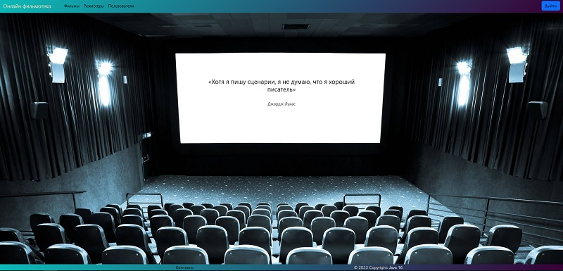
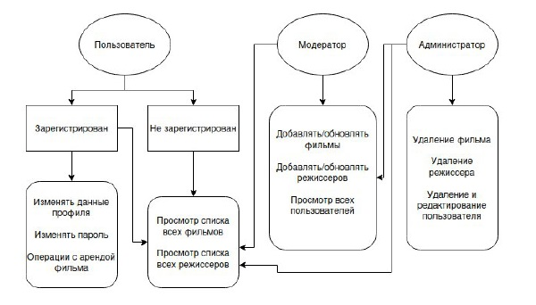
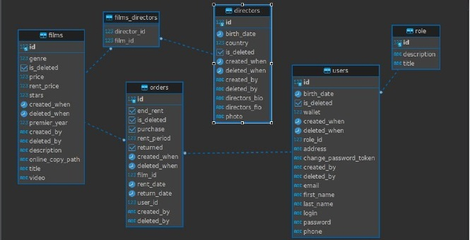
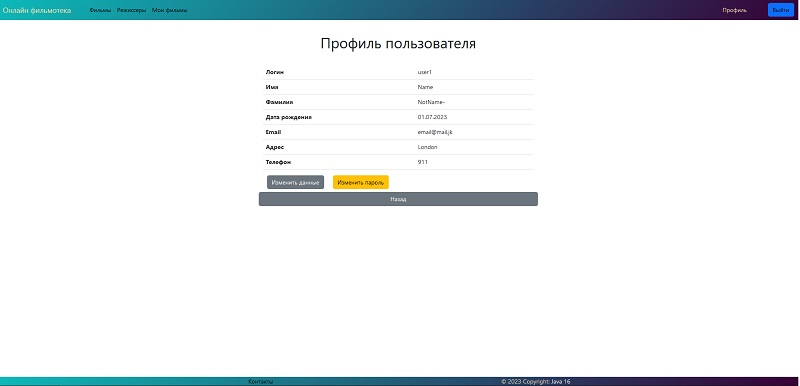
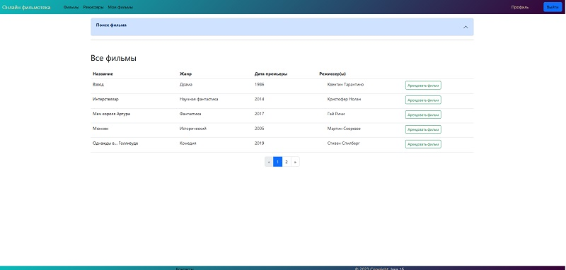
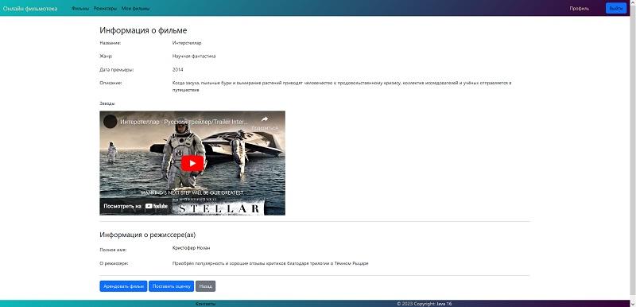

<h2  align="center">Дипломный проект курса Java-разработки "Онлайн фильмотека"</h2>

Данный проект реализует небольшое web приложение, с размещением в нем информации о фильмах, а также о режиссерах.

### Главная страница

---

**Реализованы 3 ролевых модели:**
- Администратор
- Модератор
- Пользователь

**Use-Case диаграмма**

---

**Схема базы данных**

---

### Использованы следующие инструменты:
- Java 17
- Maven
- Spring Framework
- Spring DATA, JPA
- Spring Security
- Swagger
- Docker
- PostgreSQL

---

**Страница пользователя**

**Страница всех фильмов**

**Страница фильма**

[//]: # (env.properties)
[//]: # ()
[//]: # (db_user=user1)
[//]: # (db_pass=12345)
[//]: # ()
[//]: # (name=admin)
[//]: # (password=$2a$10$GlvNrelbWOWZzbKi.S.WrOUosmmNOef6YnOlWuOaG.UvSvyxlr1Nu)
[//]: # (role=ADMIN)
[//]: # ()
[//]: # (mail.log=@gmail.com)
[//]: # (mail.pass=yrhwghgkyxnhrxei)
